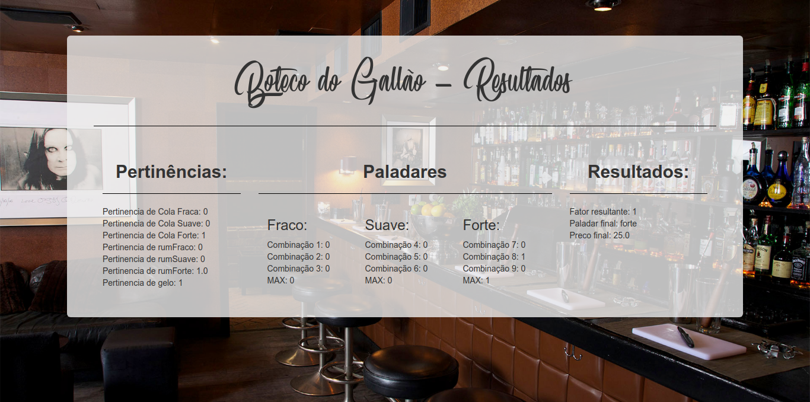

# Boteco do Gallao
Exercício Lógica Fuzzy - FATEC São Caetano do Sul - Aula de Inteligência Artificial

# Sobre o exercício

Lógica Fuzzy é baseada na teoria dos conjuntos fuzzy. Vai de contraponto a
lógica difusa, baseada em extremos, 1 e 0.

A Lógica Fuzzy é útil para problemas onde as variáveis de controle podem
existir em estados indeterminados, entre os extremos de 1 e 0, verdadeiro e
falso.

O assunto de Lógica Fuzzy é abordada pela matéria de Inteligência Artificial
na FATEC São Caetano do Sul, ministrada pelo Prof. Dr. Celso Gallão. 

# Sobre o programa

Boteco do Gallão é uma aplicação web, escrita em Python, JavaScript, HTML
e CSS, utilizando da framework Flask do Python para auxílio da construção
de um servidor e render de páginas web.

O programa tem o propósito de receber do usuário quantidades de refrigerante
a base de cola, rum e gelo e retornar um relatório sobre cálculos dos fatores
fuzzy, uma categoria de paladar e preço estipulado sobre um drink Cuba Livre.

O servidor da aplicação foi construída com Python 3 em mente. Python 2 não
suportado.

O programa tem objetivo puramente educacional, feito para matéria de 
Inteligência Artificial na FATEC São Caetano do Sul.

## Imagens

# Recrindo ambiente de desenvolvimento

O ambiente de desenvolvimento é instalado com auxílio do pacote virtualenv, que
é resposável por isolar o ambiente do projeto do ambiente do Sistema 
Operacional. Isso é recomendável para manter consistência do sistema, não
conflitando pacotes importantes com o projeto.

> Para usuários Ubuntu LTS 16.04 ou inferior:
> Para executar os comandos abaixo em Python 3, apenas troque o nome do
> comando por sua variante <comando>3. Ex.: python -> python3; pip -> pip3

Para verificar sua versão do Python, execute o comando:
`python --version`

Certifique-se que esteja utilizando a versão 3.

Para instalar virtualenv, execute o comando:
`pip install virtualenv`

Teste com o comando:
`virtualenv --version`

Para criar um ambiente, execute o comando:
`virtualenv <nome_projeto>`

Para ativar o ambiente, execute o comando:
`source <nome_projeto>/bin/activate`

Para desativar o ambiente, execute o comando:
`deactivate`

Quando ativado, o nome do ambiente (ou nome do projeto) é exibido no terminal.

Todo script Python executado pelo terminal com ambiente ativado usa o mesmo
como base.

# Executando servidor
Execute na linha de comando (de preferência dentro da pasta de projeto):

`pip install -r requirements.txt`

Isto vai instalar as dependências do projeto no seu sistema. Se possível, 
instale as dependências em modo usuário do pip para evitar conflitos com outros
projetos (caso não esteja utilizando ambientes de projeto virtualizados).

Para instalar dependências em modo usuário, execute o comando:
`pip install --user -r requirements.txt`

Após instaladas as dependências, execute o script principal:

`python app.py`

O servidor por padrão estará ouvindo em:

**localhost:5000**
